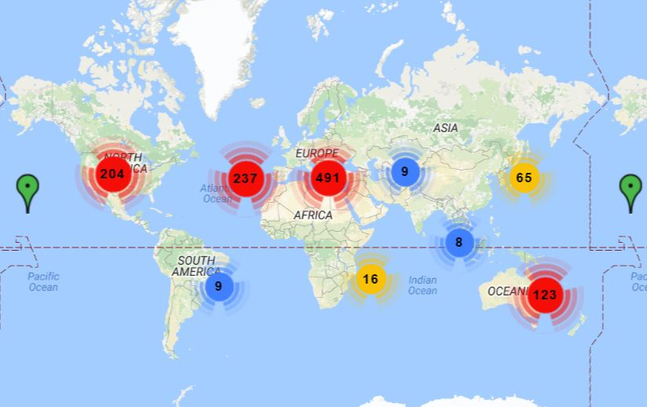
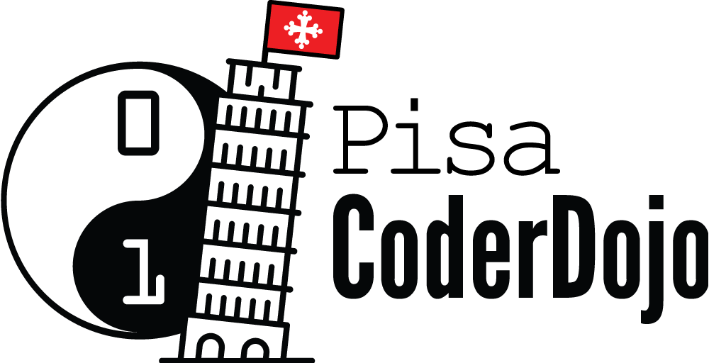

## Insegniamo ai giovani a programmare
#### Linux Day 2016 Pisa

<small>a cura di</small>

 <!-- .element: class="noshadow" -->

## Chi sono?
 <!-- .element: style="height: 500px" -->

 <!-- .element: class="noshadow" -->
**coder** = programmatore

**dojo** = palestra, tempio dell'apprendimento

## Diffusione

CoderDojo è un movimento **globale**, **gratuito** e **volontario** di club di programmazione per giovani.

Il movimento è basato sul modello **Open Source**, ovvero chiunque aderisca all'**etica** e ai principi di CoderDojo può organizzare un Dojo in qualsiasi posto del mondo.

Al Dojo i **giovani tra i 7 e i 17 anni** imparano a

programmare, <!-- .element: class="fragment" -->

sviluppare siti web, <!-- .element: class="fragment" -->

applicazioni, <!-- .element: class="fragment" -->

giochi, <!-- .element: class="fragment" -->

esplorano la tecnologia in un ambiente **informale** e **creativo**.
 <!-- .element: class="fragment" -->

CoderDojo dimostra come la programmazione possa davvero cambiare il mondo.

I Dojo si basano sulla **comunità locale**, l'apprendimento collaborativo **tra pari** e l'apprendimento **autonomo**.

Non ci sono obiettivi prefissati, si vuole condividere un'**esperienza di apprendimento**.

Gratuita e aperta.

## Principi Fondanti

[\#Etica]() [\#Cultura]() [\#Felicità]() [\#Risultati]()

## Ruoli

## Motti
- I genitori partecipano! <!-- .element: class="fragment" -->

- Una sola regola: strabiliateci! <!-- .element: class="fragment" -->

- Chiedi a tre e dopo a me! <!-- .element: class="fragment" -->

- Se l'hai fatto, puoi giocarci! <!-- .element: class="fragment" -->

## Che cosa si impara
 

**Hard Skill**

linguaggi di programmazione, framework e hardware

**Soft Skill**

collaborazione, comunicazione, problem solving, pensiero analitico, autostima

## Come si impara
Ogni Dojo è differente, non ci sono curriculum predefiniti.
 

 <!-- .element: class="noshadow" -->

 <!-- .element: class="noshadow" -->

note:
Il Dojo si basa sull'apprendimento per progetti:
1. si insegnano le basi
1. si insegnano gli argomenti avanzati a seconda dei progetti di ciascuno

 <!-- .element: class="noshadow" -->

## Dojo@SMS

## Dojo@Scuola

## DojoCon Toscana 2016

<!-- .slide: data-background-video="img/dojocon.mp4" -->

## Dojo in Azione
Tecnologie più utilizzate per l'educazione dei bambini:

- Scratch <!-- .element: class="fragment" -->

- Python (pyTurtle, pyGame) <!-- .element: class="fragment" -->

- App Inventor <!-- .element: class="fragment" -->

<!-- ## Scratch -->

Scratch è un linguaggio di programmazione visuale a blocchi.

E' un **linguaggio completo** che permette la creazione di animazioni e giochi.

note:
Sfrutta il paradigma della programmazione imperativa ed ad eventi per animare a schermo gli *sprite*

## Scratch: versioni
Ci sono due versioni entrambe opensource:

- 
**Scratch 1.0**, implementato in Smalltalk, disponibile sulle maggiori distribuzioni (`apt-get install scratch`)
 <!-- .element: class="fragment" -->

- 
**Scratch 2.0**, implementato in Flash, disponibile online (https://scratch.mit.edu)
 <!-- .element: class="fragment" -->

- 
**Scratch 3.0**, implementato in HTML5, disponibile dal 2017
 <!-- .element: class="fragment" -->

### Scratch 1.0
 <!-- .element: class="noborder" -->

### Scratch 2.0
 <!-- .element: class="noborder" -->

### Condividere il tuo progetto
 <!-- .element: class="noborder" -->

### Vedere il sorgente
 <!-- .element: class="noborder" -->

### Creare un remix
 <!-- .element: class="noborder" -->

### Incorporare nell'HTML
<iframe allowtransparency="true" width="785" height="610" src="//scratch.mit.edu/projects/embed/25195961/?autostart=false" frameborder="0" allowfullscreen></iframe>

## Lo Sprite
Lo *sprite* è un oggetto a schermo composto da:

- 
uno o più **costumi**, 
 <!-- .element: class="fragment" -->

- 
un porzione di **codice** che ne descrive il comportamento,
 <!-- .element: class="fragment" -->

- 
una **posizione** sullo schermo.
 <!-- .element: class="fragment" -->

## I Blocchi
- 
**Comandi**:  <!-- .element: class="nomargin noshadow" --> sono istruzioni 
 <!-- .element: class="fragment" -->

- 
**Situazioni**:  <!-- .element: class="nomargin noshadow" style="height:70px"--> sono i primi blocchi da utilizzare 
<!-- .element: class="fragment" -->

- 
**Funzioni**:  <!-- .element: class="nomargin noshadow" --> da usare all'interno dei controlli 
 <!-- .element: class="fragment" -->

- 
**Controllo**:  <!-- .element: class="nomargin noshadow" --> gestiscono il flusso del codice 
 <!-- .element: class="fragment" -->

## Scratch: esempio

 <!-- .element: class="noborder" -->

 <!-- .element: class="fragment" -->

 <!-- .element: class="noborder" -->

 <!-- .element: class="fragment" -->

<!--  -->
## Recruit
Vuoi diventare mentore?

Conosci dei ninja a cui consigliarlo?

contatti:

[pisa.coderdojo.it](http://pisa.coderdojo.it)

[pisa.it@coderdojo.com](pisa.it@coderdojo.com)

 <!-- .element: class="noshadow" -->

## #
> Anyone who stops learning is old, whether at twenty or eighty. Anyone who keeps learning stays young.

<small>Henry Ford <!-- .element: style="text-align: right" --> </small>

 This work is licensed under a <a rel="license" href="http://creativecommons.org/licenses/by-nc/4.0/">Creative Commons Attribution-NonCommercial 4.0 International License</a>.
