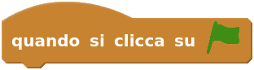

## Insegniamo ai bambini a programmare
#### Linux Day 2016 Pisa

<small>a cura di</small>

 <!-- .element: class="noshadow" -->

## Chi sono?
 <!-- .element: style="height: 500px" -->

 <!-- .element: class="noshadow" -->
**coder** = programmatore

**dojo** = palestra, tempio dell'apprendimento

## Diffusione

CoderDojo è un movimento **globale**, **gratuito** e **volontario** di club di programmazione per giovani.

Il movimento è basato sul modello **Open Source**, ovvero chiunque aderisca all'**etica** e ai principi di CoderDojo può organizzare un Dojo in qualsiasi posto del mondo.

Al Dojo i **giovani tra i 7 e i 17 anni** imparano a

programmare, <!-- .element: class="fragment" -->

sviluppare siti web, <!-- .element: class="fragment" -->

applicazioni, <!-- .element: class="fragment" -->

giochi, <!-- .element: class="fragment" -->

esplorano la tecnologia in un ambiente **informale** e **creativo**.
 <!-- .element: class="fragment" -->

CoderDojo dimostra come la programmazione possa davvero cambiare il mondo.

I Dojo si basano sulla **comunità locale**, l'apprendimento collaborativo **tra pari** e l'apprendimento **autonomo**.

Non ci sono obiettivi prefissati, si vuole condividere un'esperienza di apprendimento.
Gratuita e aperta.

## Ruoli

## Motti
- I genitori partecipano! <!-- .element: class="fragment" -->

- Una sola regola: strabiliateci! <!-- .element: class="fragment" -->

- Chiedi a tre e dopo a me! <!-- .element: class="fragment" -->

- Se l'hai fatto puoi giocarci! <!-- .element: class="fragment" -->

## Che cosa si impara
- *Hard Skill*: linguaggi di programmazione, framework e hardware

- *Soft Skill*: collaborazione, comunicazione, problem solving, pensiero analitico, autostima

## Come si impara
Ogni Dojo è differente, non ci sono curriculum predefiniti. <!-- .element: style="text-align: left" -->

Il Dojo si basa sull'apprendimento per progetti: <!-- .element: style="text-align: left" -->
1. si insegnano le basi <!-- .element: class="fragment" -->
1. si insegnano gli argomenti avanzati a seconda dei progetti di ciascuno <!-- .element: class="fragment" -->

## Dojo@SMS

## Dojo@Scuola

## DojoCon Toscana

## #
> Anyone who stops learning is old, whether at twenty or eighty. Anyone who keeps learning stays young.

<small>Henry Ford <!-- .element: style="text-align: right" --> </small>

## Dojo in azione
- Scratch

- pyGame

## Scratch

Scratch è un linguaggio di programmazione visuale a blocchi.

E' un **linguaggio completo** che permette la creazione di animazioni e giochi.

note:
Sfrutta il paradigma della programmazione imperativa ed ad eventi per animare a schermo gli *sprite*

## Scratch: versioni
Ci sono due versioni entrambe opensource:

- **Scratch 1**, scritto in Smalltalk, disponibile sulle maggiori distribuzioni (`apt-get install scratch`)

- **Scratch 2**, scritto in Flash, disponibile online (https://scratch.mit.edu)

## Scratch: interfaccia

## Scratch: comandi
- **Comandi**:  <!-- .element: class="nomargin" --> sono istruzioni

- **Situazioni**:  <!-- .element: class="nomargin" --> sono i primi blocchi da utilizzare

- **Funzioni**:  <!-- .element: class="nomargin" -->  <!-- .element: class="nomargin" --> da usare all'interno dei controlli

- **Controllo**:  <!-- .element: class="nomargin" --> gestiscono il flusso del codice

## Scratch: esempio

 This work is licensed under a <a rel="license" href="http://creativecommons.org/licenses/by-nc/4.0/">Creative Commons Attribution-NonCommercial 4.0 International License</a>.
